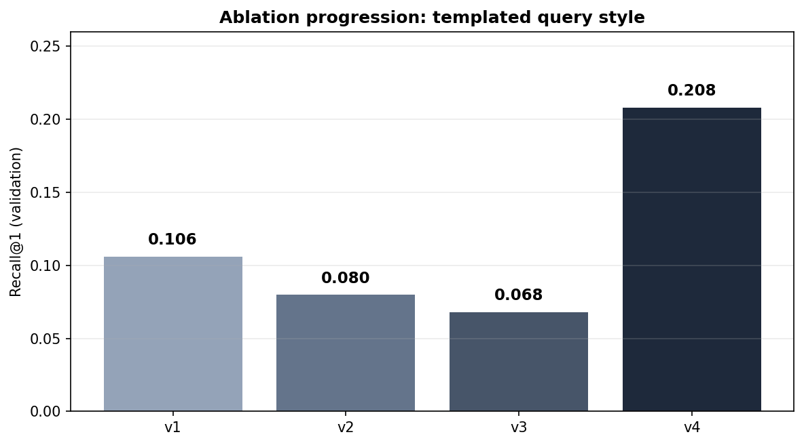
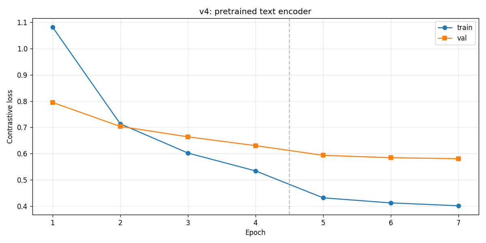
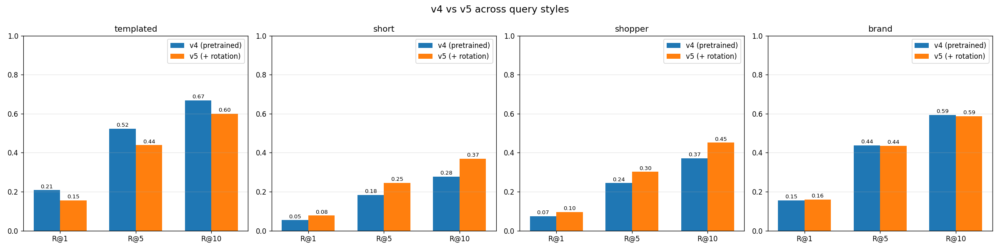
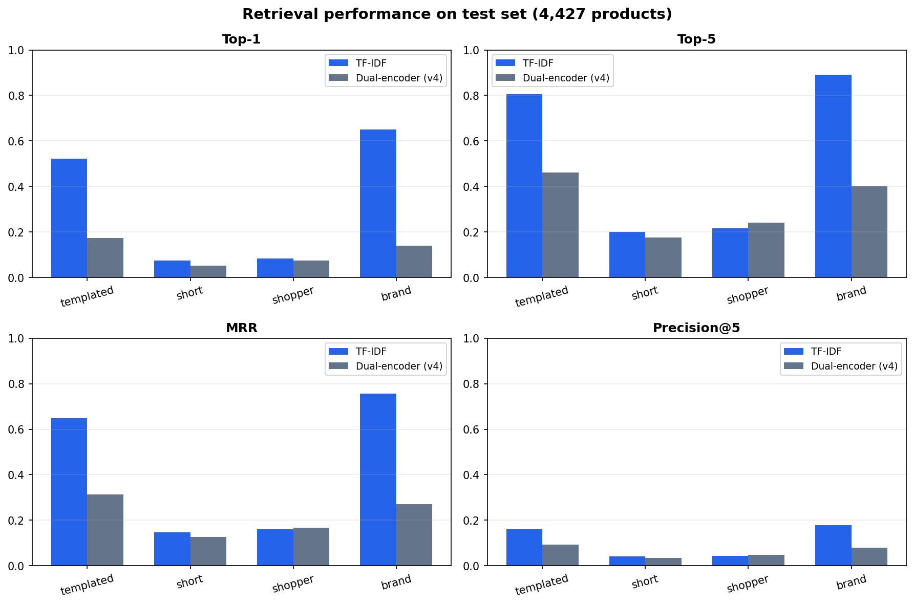
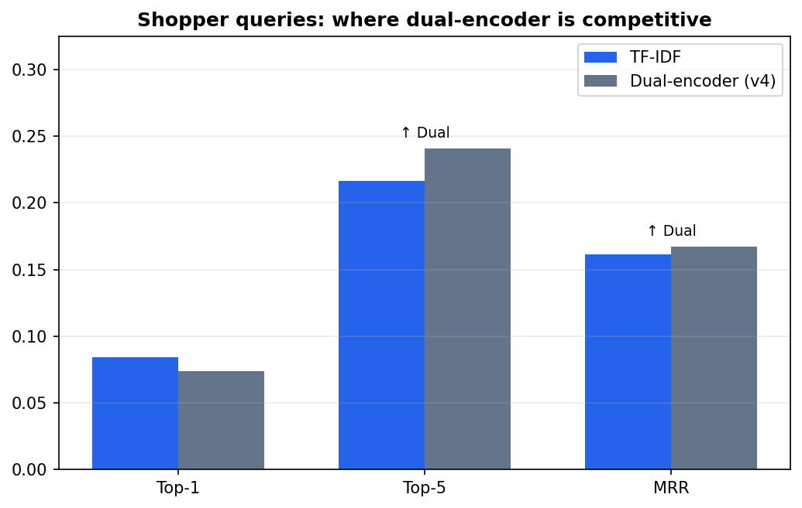
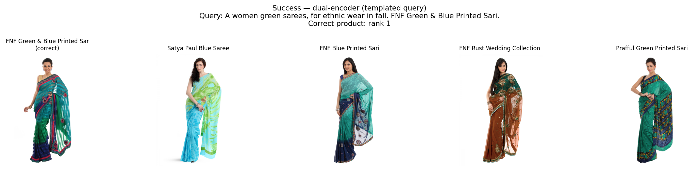
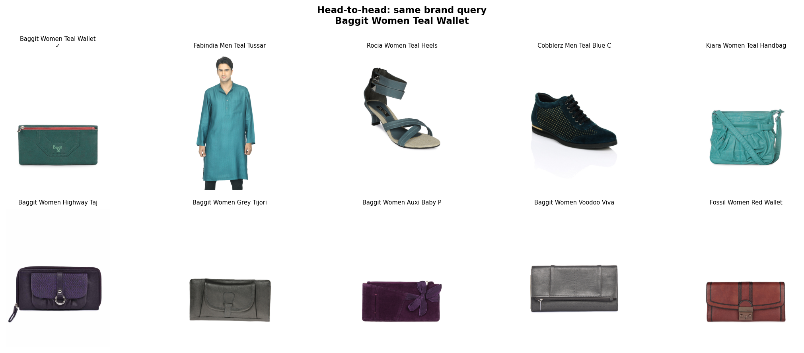
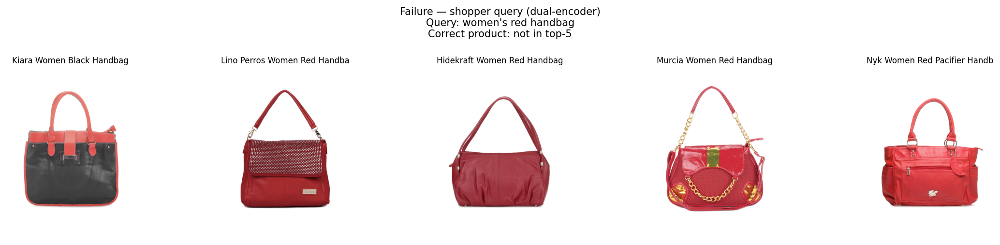

# Final Report: Multimodal Deep Learning Search Engine for E-commerce Fashion

**Course:** DSCI471 — Deep Learning  
**Team:** Richardson Chhin, Samii Shabuse  
**Date:** May 2026

---

## Abstract

We built and evaluated a multimodal fashion product search system that maps natural-language queries to product images using a dual-encoder architecture trained with contrastive learning. A TF-IDF keyword baseline indexes the same catalog using rich product text (structured attributes plus optional JSON descriptions). On a held-out test gallery of 4,427 products, TF-IDF outperforms our final dual-encoder (v4) on Top-1 accuracy for all four query styles, with the largest gaps on templated (0.52 vs 0.17) and brand (0.65 vs 0.14) queries. The dual-encoder remains competitive on shopper-style queries at Top-5 (0.24 vs 0.22) and MRR (0.167 vs 0.161), indicating that cross-modal retrieval can surface relevant products in the top ranks even when rank-1 accuracy is low. We document an iterative v1→v5 model development path and conclude that keyword search remains stronger when the retrieval index is fully text-based, while dual-encoders are a viable approach when the deployment target is image galleries or text-to-image matching.

**Keywords:** multimodal retrieval, dual-encoder, contrastive learning, fashion e-commerce, TF-IDF baseline

---

## 1. Introduction

### 1.1 Motivation

E-commerce search often relies on exact keyword matching against product titles and metadata. Shoppers frequently describe items in natural language—for example, *"a flowy floral dress with cap sleeves"*—rather than using brand names or catalog terms. When keyword overlap is weak, retrieval quality drops, hurting product discovery, conversion, and user satisfaction.

Multimodal deep learning offers an alternative: learn a shared embedding space where text queries and product images are directly comparable. If a model can align visual and textual representations, it may retrieve semantically relevant products even without exact term matches.

### 1.2 Research question

> **Can a dual-encoder deep learning model, trained on paired fashion images and text descriptions, outperform traditional keyword-based e-commerce search?**

We compare a dual-encoder retriever against a TF-IDF baseline on the same test gallery, query styles, and relevance criterion.

### 1.3 Contributions

1. A full data pipeline for ~44k fashion products with unified captions and text indices (`src/prepare_data.py`).
2. An iterative ablation study (v1→v5) documenting caption design, query-style augmentation, and pretrained text encoders (`notebooks/richardson_experiment/`).
3. A reproducible evaluation framework reporting Top-1, Top-5, MRR, and Precision@5 (`src/evaluate.py`).
4. An honest cross-modal vs text-to-text comparison explaining when each approach wins.

---

## 2. Related work

**Dual-encoder retrieval.** CLIP (Radford et al., 2021) popularized contrastive pretraining of image and text encoders on web-scale data, enabling zero-shot retrieval by cosine similarity. Our project applies the same retrieval paradigm at course scale on a fashion catalog with domain-specific captions.

**Fashion and e-commerce search.** Prior work on fashion retrieval uses attribute prediction, siamese networks, and multimodal embeddings for recommendation and visual search. Structured attributes (color, category, gender) are common weak supervision signals—exactly what the Kaggle Fashion Product Images dataset provides.

**Keyword baselines.** TF-IDF and BM25 remain strong baselines for text-heavy catalogs, especially when product descriptions are detailed. Our baseline is intentionally strong: it indexes `product_text` that combines templated captions with JSON product descriptions when available.

---

## 3. Data

### 3.1 Source

We use the [Fashion Product Images dataset](https://www.kaggle.com/datasets/paramaggarwal/fashion-product-images-dataset) (Aggarwal, Kaggle): ~44,400 professionally photographed products with CSV metadata (`styles.csv`) and per-product JSON records (`styles/{id}.json`).

Each product links:

- Image: `images/{id}.jpg`
- Structured fields: gender, category, article type, color, season, usage, display name
- Optional free-text description in JSON

### 3.2 Preprocessing

Pipeline: `src/prepare_data.py`

1. Keep products with existing image files.
2. Load JSON descriptions when present (44,136 of 44,419 imaged products).
3. Build **captions** from attributes via `src/captions.py` (templated natural-language strings).
4. Build **product_text** = caption + JSON description (used by TF-IDF).
5. Drop rare `articleType` values (< 10 samples).

**Final corpus:** 44,265 products.

### 3.3 Splits

| Split | Products | Purpose |
|---|---|---|
| Train | 35,412 | Dual-encoder training |
| Validation | 4,426 | Development / ablation metrics |
| Test | 4,427 | **Final evaluation gallery** |

Split ratio 80/10/10, stratified by `articleType`, random seed 42.

Outputs: `data/processed/train.csv`, `val.csv`, `test.csv`, `products.csv`, `pairs.csv`.

### 3.4 Query styles (evaluation)

Each test product generates a query from its own row using four styles:

| Style | Description | Example |
|---|---|---|
| **templated** | Full attribute caption | `A men navy blue shirts, for casual wear in fall. Turtle Check Men Navy Blue Shirt.` |
| **shopper** | Short natural phrase | `men's navy blue shirt` |
| **brand** | Product display name | `Turtle Check Men Navy Blue Shirt` |
| **short** | Color + article type | `navy shirt` |

The same styles are used for TF-IDF and dual-encoder evaluation.

---

## 4. Methods

### 4.1 Dual-encoder architecture (final model v4)

| Component | Specification |
|---|---|
| Image encoder | EfficientNetB0 (ImageNet pretrained), 224×224 input → dense layers → **384-d** L2-normalized embedding |
| Text encoder | Frozen `sentence-transformers/all-MiniLM-L6-v2` → **384-d** L2-normalized embedding |
| Similarity | Cosine similarity (dot product of normalized vectors) |
| Training loss | Symmetric contrastive loss (InfoNCE-style), temperature τ = 0.07 |

**Training procedure** (`src/train.py`):

1. **Phase 1:** Freeze EfficientNet backbone; train image tower 4 epochs, Adam lr = 1e-3, batch size 64.
2. **Phase 2:** Unfreeze last 20 EfficientNet layers; fine-tune 3 epochs, lr = 1e-5.
3. Text embeddings precomputed and cached (`models/embeddings/train_text.npy`, `val_text.npy`).

Implementation: `src/model.py`, `src/config.py`.

### 4.2 TF-IDF baseline

- `TfidfVectorizer` (English stop words, max 50,000 features) on test-gallery `product_text`.
- Query embedded in the same space; cosine similarity ranking.
- Implementation: `src/baseline_keyword.py`, evaluation in `src/evaluate.py`.

This baseline performs **text-to-text** retrieval with access to full product descriptions. The dual-encoder performs **text-to-image** retrieval—a harder cross-modal task.

### 4.3 Evaluation protocol

- **Gallery:** all 4,427 test products.
- **Queries:** one per product per style; target = that product's ID.
- **Metrics:** Top-1, Top-5, MRR, Precision@5 (standard retrieval definitions in `src/metrics.py`).
- **Fairness:** identical gallery, queries, and relevance rule for both models.

Regenerate: `python src/evaluate.py` → `docs/reports/evaluation_results.csv`.

**Note:** Development ablations (Section 5) report Recall@K on the **validation** set. Final numbers in Section 6 are on the **held-out test** set.

---

## 5. Experiments and model selection

Richardson led an iterative ablation (`notebooks/richardson_experiment/01–08`). Samii unified training and evaluation in `src/`.

| Version | Key change | Outcome |
|---|---|---|
| **v1** | Scratch text encoder, templated captions, full dataset | Baseline dual-encoder |
| **v2** | Four query-style captions (templated, short, shopper, brand) | More realistic query diversity |
| **v3** | Random query style per training epoch (rotation) | Did not clearly beat v2 |
| **v4** | Frozen MiniLM text encoder + EfficientNet image tower | **Selected final model** — best validation Recall@K |
| **v5** | v4 + caption rotation | Did not beat v4 on validation |

### 5.1 Validation ablation (Recall@1, templated query)

| Model | R@1 | R@5 | R@10 |
|---|---|---|---|
| v1 (scratch text) | 0.106 | 0.332 | 0.488 |
| v2 (caption expansion) | 0.080 | 0.271 | 0.425 |
| v3 (rotation) | 0.068 | 0.247 | 0.387 |
| **v4 (MiniLM text)** | **0.208** | **0.523** | **0.668** |

Pretrained text encoding was the largest single improvement. v5 templated R@1 (0.155) remained below v4 (0.208). Source: `docs/reports/ablations/v1_v2_v3_v4_comparison.csv`, `final_comparison.csv`.

**Figure 3** — Validation Recall@1 progression (templated query):



**Figure 4** — v4 contrastive training loss and v4 vs v5 per query style (validation):





### 5.2 Hyperparameters (v4, final)

See `src/config.py`: batch size 64, τ = 0.07, 4 + 3 training epochs, image size 224, embedding dim 384.

---

## 6. Results

### 6.1 Test-set comparison (4,427 products)

**Table 1 — Full metrics.** Source: `docs/reports/evaluation_results.csv`.

| Model | Query type | Top-1 | Top-5 | MRR | Precision@5 |
|---|---|---|---|---|---|
| TF-IDF | templated | **0.523** | **0.805** | **0.649** | **0.161** |
| TF-IDF | shopper | **0.084** | 0.216 | 0.161 | **0.043** |
| TF-IDF | brand | **0.651** | **0.891** | **0.756** | **0.178** |
| TF-IDF | short | **0.073** | **0.201** | **0.146** | **0.040** |
| Dual-encoder (v4) | templated | 0.174 | 0.462 | 0.314 | 0.092 |
| Dual-encoder (v4) | shopper | 0.074 | **0.241** | **0.167** | 0.048 |
| Dual-encoder (v4) | brand | 0.140 | 0.402 | 0.270 | 0.080 |
| Dual-encoder (v4) | short | 0.052 | 0.176 | 0.126 | 0.035 |

*Bold indicates higher value for each query type / metric pair.*

**Figure 1** — Test-set retrieval metrics (TF-IDF vs dual-encoder v4):



**Figure 2** — Shopper queries: dual-encoder wins Top-5 and MRR despite lower Top-1:



### 6.2 Answer to the research question

**No — on our test setup, the dual-encoder does not outperform TF-IDF on Top-1 accuracy for any query style.**

| Query type | TF-IDF Top-1 | Dual-encoder Top-1 | Δ (dual − TF-IDF) |
|---|---|---|---|
| templated | 0.523 | 0.174 | −0.349 |
| shopper | 0.084 | 0.074 | −0.010 |
| brand | 0.651 | 0.140 | −0.511 |
| short | 0.073 | 0.052 | −0.022 |

The gap is largest when queries align with indexed text: **brand** (product names) and **templated** (full captions matching `product_text`).

**Partial success:** On **shopper** queries, the dual-encoder achieves higher **Top-5** (0.241 vs 0.216) and **MRR** (0.167 vs 0.161). So cross-modal retrieval sometimes ranks the correct product in the top 5 even when it misses rank 1—relevant for UI designs that show multiple results.

### 6.3 Qualitative retrieval examples

**Figure 5** — Dual-encoder success (templated query, correct product at rank 1):



**Figure 6** — Head-to-head on a brand query (TF-IDF top row vs dual-encoder bottom row):



**Figure 7** — Shopper-query failure (correct product not in dual-encoder top 5):



Interactive demos: `notebooks/samii_experiment/04_final_results.ipynb`.

---

## 7. Discussion

### 7.1 Why TF-IDF wins Top-1

1. **Modality mismatch in evaluation.** TF-IDF searches text against text, including JSON descriptions. The dual-encoder must match text queries to **visual** embeddings. Attribute text does not fully determine appearance (fabric, cut, pattern details).

2. **Brand and templated queries favor keywords.** Brand queries are exact product titles; templated queries closely mirror indexed captions. TF-IDF is optimized for this overlap.

3. **Training signal vs deployment.** The dual-encoder is trained with templated training captions but evaluated on diverse query styles. v2–v3 ablations showed query-style design matters; v4 improved substantially but did not close the gap to a strong text index.

### 7.2 When deep learning still helps

- **Image-forward retrieval:** If the product gallery is images only (no rich text at index time), dual-encoders are appropriate; TF-IDF cannot apply.
- **Top-5 / ranking quality:** Shopper-query MRR and Top-5 suggest the model learns some cross-modal alignment useful for shortlist display.
- **Semantic generalization (potential):** With more diverse training queries and larger batch contrastive learning, gap may narrow—v4's jump over v1 (validation R@1: 0.106 → 0.208) shows headroom from better text towers.

### 7.3 Development lessons

- Pretrained text encoders (v4) mattered more than caption rotation (v3, v5).
- Unified evaluation (`src/evaluate.py`) on a fixed test gallery was essential for a fair TF-IDF comparison.
- Separating validation ablations from final test metrics avoided overfitting the report narrative to dev sets.

---

## 8. Limitations

1. **Synthetic queries** — Generated from catalog attributes, not real user search logs.
2. **Low absolute Top-1** — Both models achieve ≤ 8.4% Top-1 on shopper/short queries; fashion attributes are ambiguous (many navy shirts).
3. **Compute** — Full training ~40 minutes on CPU; no large-scale hyperparameter search.
4. **Frozen text encoder** — MiniLM was not fine-tuned on fashion domain text.
5. **Single positive per query** — Standard retrieval eval; other same-category products may also be visually relevant.
6. **Reproducibility** — Model weights are generated locally (`models/README.md`); result CSVs are committed to git.

---

## 9. Conclusion and future work

We implemented a complete multimodal fashion search pipeline: data processing, dual-encoder training with contrastive loss, a TF-IDF baseline, and unified retrieval metrics on 4,427 test products. After five model iterations, **v4** (EfficientNetB0 + frozen MiniLM) was selected as the final architecture.

**Conclusion:** Traditional keyword search outperforms our dual-encoder on Top-1 accuracy across all query types in this catalog, primarily because TF-IDF operates in text-to-text space with rich product descriptions. The dual-encoder remains a viable cross-modal retriever with better shopper-query Top-5 and MRR, and it is the appropriate choice when retrieval targets image embeddings directly.

**Future work:**

- Fine-tune the text encoder on fashion caption pairs
- Hard negative mining and larger effective batch sizes
- CLIP-style domain pretraining on fashion image–text pairs
- Evaluation on real user queries and click-through data
- Hybrid retrieval: TF-IDF shortlist → dual-encoder reranking

---

## References

- Aggarwal, Param. *Fashion Product Images Dataset.* Kaggle, 2019.  
  https://www.kaggle.com/datasets/paramaggarwal/fashion-product-images-dataset

- Radford, A., et al. (2021). *Learning Transferable Visual Models From Natural Language Supervision* (CLIP). ICML.

- Reimers, N., & Gurevych, I. (2019). *Sentence-BERT: Sentence Embeddings using Siamese BERT-Networks.* EMNLP.

- Tan, M., & Le, Q. (2019). *EfficientNet: Rethinking Model Scaling for Convolutional Neural Networks.* ICML.

---

## Appendix A — Reproducibility

```powershell
python -m venv venv && venv\Scripts\activate
pip install -r requirements.txt
python src/download_kaggle_data.py
python src/prepare_data.py
python src/prepare_data.py --check
python src/train.py
python src/evaluate.py
```

Grading guide: `docs/GRADING.md`  
Artifacts: `docs/ARTIFACTS.md`  
Presentation: `docs/presentation.md` · Slides: `docs/presentation_slides.md`  
PDF report: `docs/reports/final_report.pdf` (or print `final_report.html`)  
Interactive results: `notebooks/samii_experiment/04_final_results.ipynb`

---

## Appendix B — Team contributions

| Richardson Chhin | Samii Shabuse |
|---|---|
| v1→v5 experiment design and notebooks | Unified `src/` training and evaluation pipeline |
| Caption and query-style ablations | Data preprocessing and documentation |
| Final model selection (v4) | Test-set evaluation, Phase 4 notebook, final report integration |

---

*Report generated for DSCI471 Final Project. Result tables reflect `docs/reports/evaluation_results.csv` as of project submission.*
