# Final Report: Multimodal Deep Learning Search Engine for E-commerce Fashion

**Course:** DSCI471 - Deep Learning  
**Team:** Richardson Chhin, Samii Shabuse  
**Date:** May 2026

---

## Abstract

We built and evaluated a multimodal fashion product search system that maps natural-language queries to product images using a dual-encoder architecture trained with contrastive learning. A TF-IDF keyword baseline indexes the same catalog using rich product text made from structured attributes plus JSON descriptions. On a held-out test gallery of 4,427 products, TF-IDF outperforms our final dual-encoder (v4) on Top-1 accuracy for all four query styles, with the largest gaps on templated queries (0.523 vs 0.174) and brand queries (0.651 vs 0.140). The dual-encoder remains competitive on shopper-style queries at Top-5 (0.241 vs 0.216) and MRR (0.167 vs 0.161), showing that cross-modal retrieval can place relevant products in the visible result set even when rank-1 accuracy is low.

The main result is not that deep learning "failed." Rather, the experiment shows a real tradeoff: keyword search is very strong when the index contains rich text, while dual-encoders are the appropriate architecture when the retrieval target is an image gallery or when product text is incomplete. We document the full data pipeline, exploratory analysis, v1-to-v5 model progression, final evaluation, limitations, and reproducibility steps.

**Keywords:** multimodal retrieval, dual-encoder, contrastive learning, fashion e-commerce, TF-IDF baseline

---

## 1. Introduction

### 1.1 Motivation

E-commerce search often relies on exact keyword matching against product names, categories, and metadata. Shoppers, however, frequently describe items in natural language: for example, "a flowy floral dress with cap sleeves" or "men's navy casual shirt." If the search engine depends only on exact word overlap, retrieval quality drops when shoppers use different phrasing from the catalog.

Multimodal deep learning offers a different approach. A dual-encoder model can learn a shared embedding space where text queries and product images are directly comparable. If the model learns useful visual-text alignment, it can retrieve images even when there is no exact keyword match at query time.

### 1.2 Research Question

> **Can a dual-encoder deep learning model, trained on paired fashion images and text descriptions, outperform traditional keyword-based e-commerce search?**

We compare a text-to-image dual-encoder retriever against a TF-IDF text baseline using the same test products, the same query styles, and the same retrieval metrics.

### 1.3 Contributions

1. A full preprocessing pipeline for 44,265 usable fashion products with images, structured metadata, generated captions, and text indices.
2. Exploratory analysis of product categories, article types, colors, image samples, and product-text length.
3. A dual-encoder retrieval model using EfficientNetB0 for images and MiniLM sentence embeddings for text.
4. A strong TF-IDF baseline and shared evaluation framework reporting Top-1, Top-5, MRR, and Precision@5.
5. An ablation path from v1 to v5 showing why the final v4 architecture was selected.
6. A critical interpretation explaining why TF-IDF wins Top-1 and where the dual-encoder is still useful.

---

## 2. Related Work

**Dual-encoder retrieval.** CLIP (Radford et al., 2021) popularized contrastive pretraining of image and text encoders on large image-text datasets. The core idea is to map paired images and captions close together in an embedding space while pushing mismatched pairs apart. Our project applies the same retrieval pattern at course-project scale on a fashion catalog.

**Fashion and e-commerce search.** Fashion retrieval systems often use product attributes, image features, or multimodal embeddings for search and recommendation. The Kaggle Fashion Product Images dataset is well suited to this because each item has both a product photo and metadata such as color, article type, gender, season, and usage.

**Keyword baselines.** TF-IDF and BM25 remain strong baselines for catalog search when product text is available. Our TF-IDF baseline is intentionally strong because it indexes `product_text`, which combines generated captions and JSON descriptions. This makes the comparison honest: the deep model is tested against a practical classical system rather than a weak strawman.

---

## 3. Data Collection and Exploratory Analytics

### 3.1 Source Dataset

We use the [Fashion Product Images dataset](https://www.kaggle.com/datasets/paramaggarwal/fashion-product-images-dataset) (Aggarwal, Kaggle), which contains approximately 44,400 catalog products. Each product has:

- A product image stored as `images/{id}.jpg`
- Structured fields from `styles.csv`
- Optional JSON product information from `styles/{id}.json`
- Attributes including gender, master category, subcategory, article type, base color, season, usage, and product display name

### 3.2 Preprocessing Pipeline

The preprocessing pipeline is implemented in `src/prepare_data.py`.

1. Load product metadata from `styles.csv`.
2. Keep only rows with matching image files.
3. Load JSON descriptions when present.
4. Generate templated product captions using `src/captions.py`.
5. Build `product_text` by combining generated captions and JSON descriptions.
6. Drop rare `articleType` values with fewer than 10 products.
7. Create stratified train, validation, and test splits by `articleType`.

**Final corpus:** 44,265 usable products.

| Split | Products | Purpose |
|---|---:|---|
| Train | 35,412 | Dual-encoder training |
| Validation | 4,426 | Development and ablation selection |
| Test | 4,427 | Final held-out evaluation gallery |

Split ratio is 80/10/10 with random seed 42. Outputs are saved to `data/processed/train.csv`, `val.csv`, `test.csv`, `products.csv`, and `pairs.csv`.

### 3.3 Dataset Statistics

The final processed dataset contains:

| Statistic | Value |
|---|---:|
| Products after filtering | 44,265 |
| Master categories | 6 |
| Article types | 107 |
| Base colors | 46 |
| Products with loaded JSON descriptions | 44,136 |
| Median `product_text` length | 674 characters |
| Mean `product_text` length | 638 characters |

The catalog is imbalanced, which matters for retrieval. The largest article types are T-shirts (7,066), Shirts (3,215), Casual Shoes (2,845), Watches (2,542), Sports Shoes (2,036), Kurtas (1,844), Tops (1,762), Handbags (1,759), Heels (1,323), and Sunglasses (1,073). Apparel dominates the dataset with 21,327 products, followed by Accessories (11,243) and Footwear (9,219).

**Figure 1 - Article-type distribution after preprocessing:**

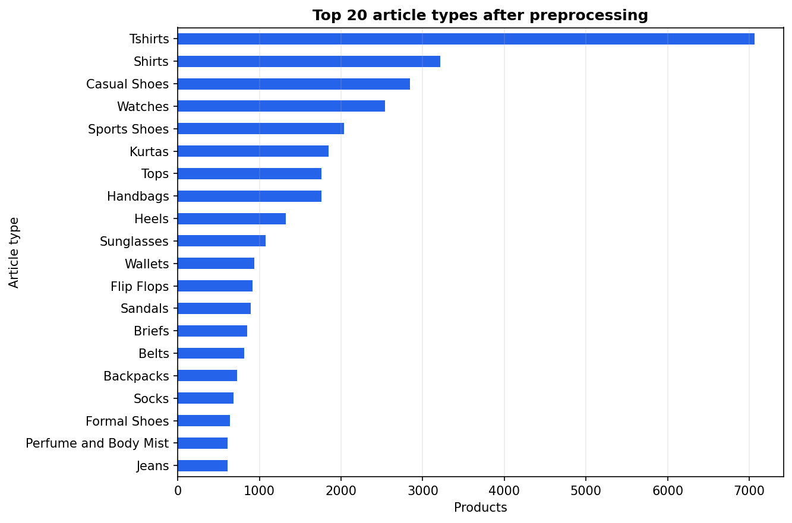

**Figure 2 - Master category distribution:**

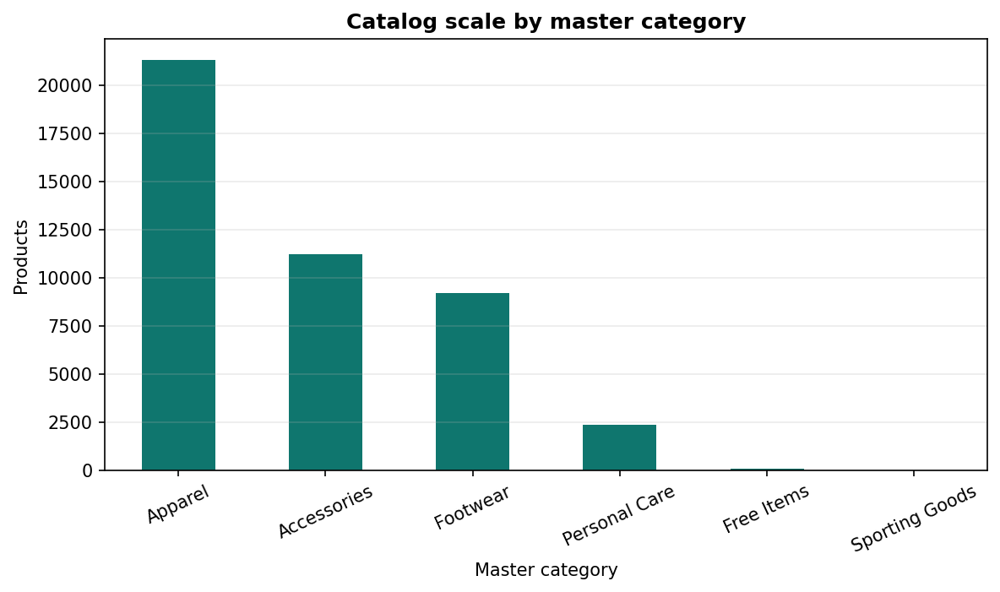

**Figure 3 - Color distribution:**

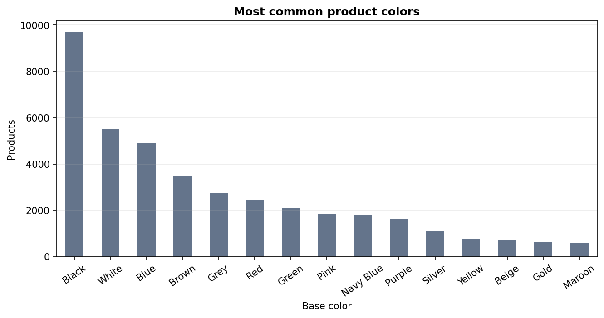

Black, white, and blue products are especially common. This creates ambiguity for short queries such as "black shoes" or "blue shirt" because many products can be visually and semantically plausible.

### 3.4 Image and Text Characteristics

The product images are clean catalog photos, usually centered on a single product with a plain background. This supports CNN feature extraction because the relevant object is usually visible and not heavily occluded. Still, the images often lack details that appear in product text, such as brand names, intended season, or product-specific titles.

**Figure 4 - Representative product images:**

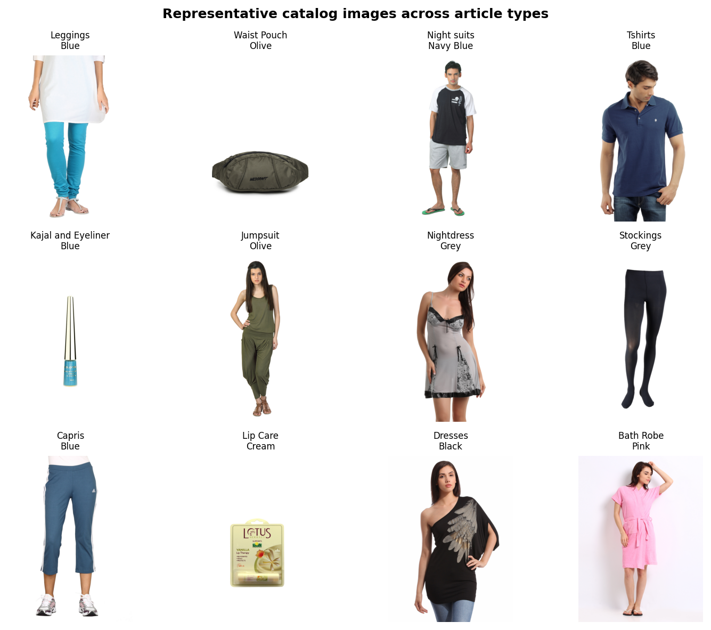

The text side is also uneven. Some rows have long JSON descriptions, while others mainly contain generated attribute captions. We therefore use a robust baseline (`product_text`) for TF-IDF and use generated captions for multimodal pairing.

**Figure 5 - Product-text length distribution:**

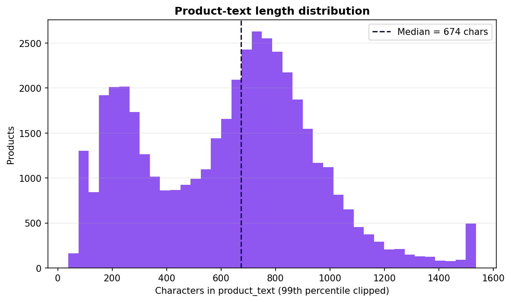

### 3.5 Evaluation Query Styles

Each test product generates one query per style:

| Style | Description | Example |
|---|---|---|
| `templated` | Full generated attribute caption | `A men navy blue shirts, for casual wear in fall. Turtle Check Men Navy Blue Shirt.` |
| `shopper` | Short natural phrase | `men's navy blue shirt` |
| `brand` | Product display name | `Turtle Check Men Navy Blue Shirt` |
| `short` | Color plus article type | `navy shirt` |

The same query generator is used for both TF-IDF and the dual-encoder, so the final comparison uses identical test cases.

---

## 4. Methodology and Model Justification

### 4.1 Final Dual-Encoder Architecture (v4)

| Component | Specification |
|---|---|
| Image encoder | EfficientNetB0, ImageNet pretrained |
| Image input size | 224 x 224 x 3 |
| Projection head | Dense(512, GELU) -> Dropout(0.1) -> Dense(384) |
| Text encoder | Frozen `sentence-transformers/all-MiniLM-L6-v2` |
| Embedding dimension | 384 |
| Normalization | L2-normalized image and text embeddings |
| Similarity | Dot product / cosine similarity |
| Loss | Symmetric contrastive loss, InfoNCE-style |
| Temperature | 0.07 |

Implementation lives in `src/model.py`, with hyperparameters in `src/config.py`.

### 4.2 Why EfficientNetB0?

EfficientNetB0 was selected because it gives a strong accuracy-to-compute tradeoff for a course-scale project. A larger CNN could improve visual representations, but would make training and reproduction harder on CPU laptops. EfficientNetB0 also comes with ImageNet-pretrained weights, giving the model general visual features such as edges, textures, shapes, and object parts before fine-tuning on fashion products.

The 224 x 224 input size matches the standard EfficientNetB0 configuration and keeps the image pipeline simple. Product photos in this dataset are mostly centered, so resizing is a reasonable spatial preprocessing step. We do not use sequence padding or temporal masking because the input is image-text pairs, not time series; the relevant spatial constraint is consistent resizing into the CNN input grid.

### 4.3 Why MiniLM Text Embeddings?

Early versions used a smaller scratch text encoder, but v4 switched to `all-MiniLM-L6-v2`. This was the largest improvement in validation ablations: templated Recall@1 rose from 0.106 in v1 to 0.208 in v4. MiniLM gives compact 384-dimensional sentence embeddings, which match the target embedding size and reduce compute. We froze MiniLM to avoid expensive transformer fine-tuning and to reduce overfitting risk given the synthetic nature of the captions.

### 4.4 Projection Head, Activation, Dropout, and Normalization

The image tower does not directly compare EfficientNet features to text embeddings. Instead, it learns a projection head:

- `Dense(512)` gives the model capacity to adapt ImageNet features to fashion attributes.
- `GELU` is a smooth nonlinearity commonly used in modern neural networks and works well with transformer-style embedding spaces.
- `Dropout(0.1)` adds light regularization without overwhelming the small projection head.
- `Dense(384)` maps image features into the same dimensionality as MiniLM text embeddings.
- L2 normalization makes dot products equivalent to cosine similarity, which is standard for retrieval embeddings.

The contrastive temperature of 0.07 sharpens the similarity distribution. Lower temperatures make the model focus more strongly on the correct image-text pair inside each batch; this is CLIP-like behavior and is appropriate when each batch contains many in-batch negatives.

### 4.5 Training Procedure

Training is implemented in `src/train.py`.

1. **Phase 1:** Freeze EfficientNetB0 and train only the projection head for 4 epochs with Adam at learning rate 1e-3.
2. **Phase 2:** Unfreeze the last 20 EfficientNet layers and fine-tune for 3 epochs with learning rate 1e-5.
3. Cache MiniLM text embeddings for train/validation captions under `models/embeddings/`.

The two-stage approach is intentional. The first stage learns a stable image-to-text projection without disrupting pretrained visual features. The second stage lightly adapts high-level EfficientNet layers to the fashion domain while avoiding large updates to the full CNN.

### 4.6 TF-IDF Baseline

The baseline uses `TfidfVectorizer(stop_words="english", max_features=50000)` on the test-gallery `product_text`. Queries are transformed into the same sparse vector space and ranked by cosine similarity.

This is a strong but realistic baseline. It performs text-to-text retrieval with access to captions and JSON descriptions. The dual-encoder performs text-to-image retrieval, which is harder because brand names and descriptions are not directly visible in the image.

### 4.7 Evaluation Protocol

For final evaluation:

- Gallery: all 4,427 held-out test products
- Queries: one query per product per query style
- Target: the exact product ID that generated the query
- Metrics: Top-1, Top-5, Mean Reciprocal Rank (MRR), Precision@5
- Code: `src/evaluate.py` and `src/metrics.py`

Development ablations use the validation split. Final results use only the test split.

---

## 5. Experiments and Model Selection

Richardson led the iterative ablation notebooks in `notebooks/richardson_experiment/`. Samii unified the final training, evaluation, and documentation pipeline in `src/` and `docs/`.

| Version | Main change | Outcome |
|---|---|---|
| v1 | Scratch text encoder, templated captions, full dataset | Established the first dual-encoder baseline |
| v2 | Caption expansion with four query styles | More realistic query diversity, but lower templated recall |
| v3 | Random query-style rotation | Did not clearly beat v2 |
| v4 | Frozen MiniLM text encoder plus EfficientNet image tower | Best validation Recall@K; selected final model |
| v5 | v4 plus caption rotation | Did not beat v4 on validation |

### 5.1 Validation Ablation

| Model | R@1 | R@5 | R@10 |
|---|---:|---:|---:|
| v1 - scratch text | 0.106 | 0.332 | 0.488 |
| v2 - caption expansion | 0.080 | 0.271 | 0.425 |
| v3 - rotation | 0.068 | 0.247 | 0.387 |
| **v4 - MiniLM text** | **0.208** | **0.523** | **0.668** |

Pretrained text encoding was the most important improvement. Caption rotation did not automatically help because the generated query styles were still synthetic and sometimes too ambiguous.

**Figure 6 - Validation Recall@1 progression:**

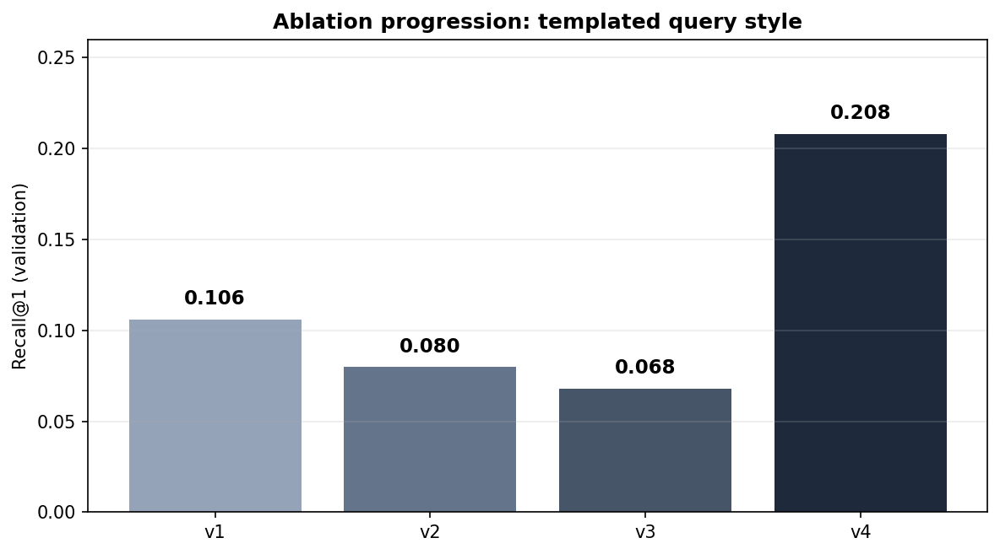

**Figure 7 - v4 training loss and v4/v5 comparison:**

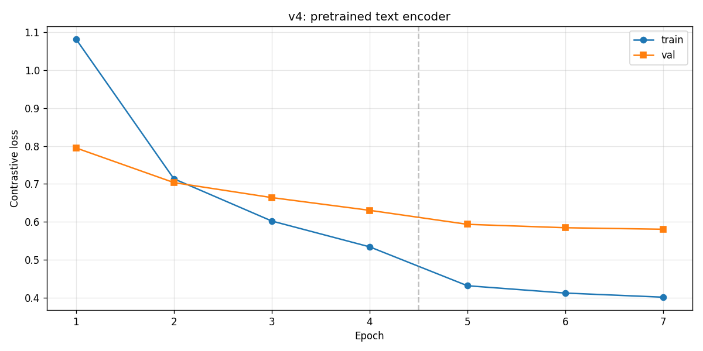

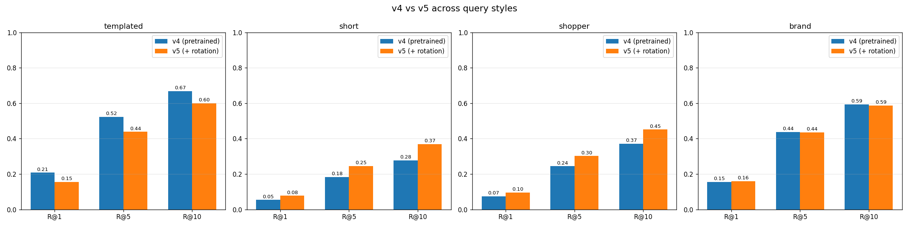

---

## 6. Results

### 6.1 Test-Set Metrics

Full metrics are stored in `docs/reports/evaluation_results.csv`.

| Model | Query type | Top-1 | Top-5 | MRR | Precision@5 |
|---|---|---:|---:|---:|---:|
| TF-IDF | templated | **0.523** | **0.805** | **0.649** | **0.161** |
| TF-IDF | shopper | **0.084** | 0.216 | 0.161 | 0.043 |
| TF-IDF | brand | **0.651** | **0.891** | **0.756** | **0.178** |
| TF-IDF | short | **0.073** | **0.201** | **0.146** | **0.040** |
| Dual-encoder (v4) | templated | 0.174 | 0.462 | 0.314 | 0.092 |
| Dual-encoder (v4) | shopper | 0.074 | **0.241** | **0.167** | **0.048** |
| Dual-encoder (v4) | brand | 0.140 | 0.402 | 0.270 | 0.080 |
| Dual-encoder (v4) | short | 0.052 | 0.176 | 0.126 | 0.035 |

**Figure 8 - Test-set retrieval metrics:**

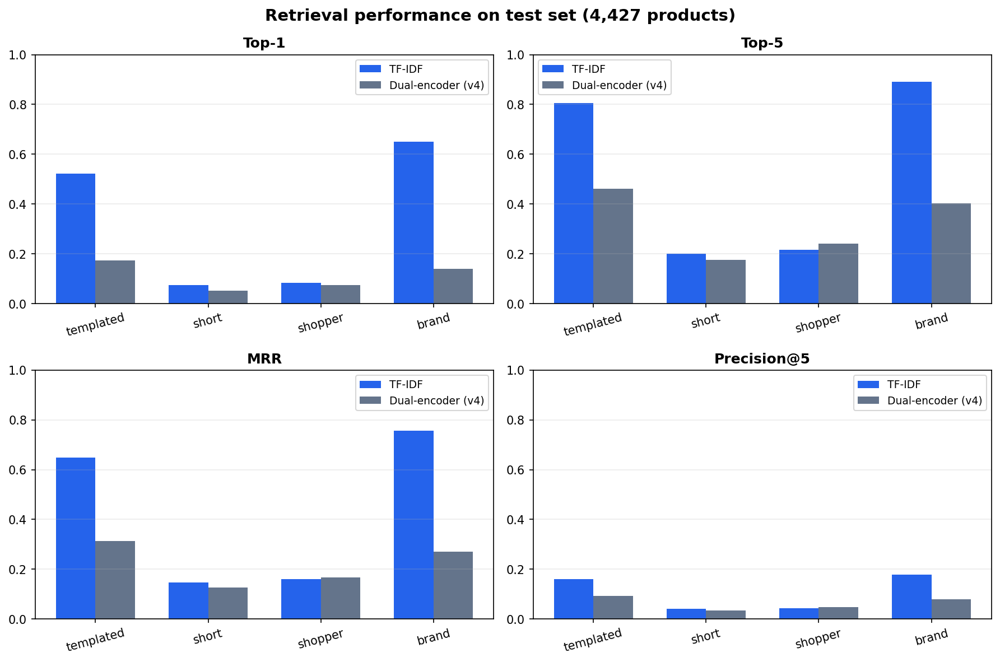

**Figure 9 - Shopper-query comparison:**

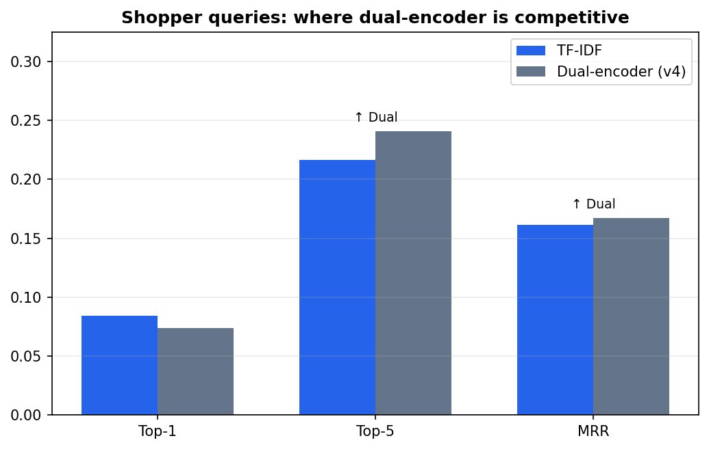

### 6.2 Answer to the Research Question

The answer is **no** for Top-1 retrieval in this test setup. The dual-encoder does not outperform TF-IDF on rank-1 accuracy for any query style.

| Query type | TF-IDF Top-1 | Dual Top-1 | Difference |
|---|---:|---:|---:|
| templated | 0.523 | 0.174 | -0.349 |
| shopper | 0.084 | 0.074 | -0.010 |
| brand | 0.651 | 0.140 | -0.511 |
| short | 0.073 | 0.052 | -0.022 |

The result is strongest for brand and templated queries because those queries closely match the text indexed by TF-IDF. Brand names and product titles are often not visible in the image, so the dual-encoder cannot recover that information from pixels alone.

The dual-encoder's best relative result is on shopper queries, where it beats TF-IDF on Top-5 and MRR. That means it sometimes places the exact item higher in the shortlist even when it misses the top position.

### 6.3 Qualitative Retrieval Examples

**Figure 10 - Dual-encoder success on a templated query:**

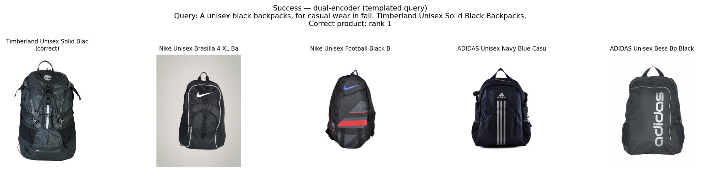

**Figure 11 - Brand-query head-to-head:**

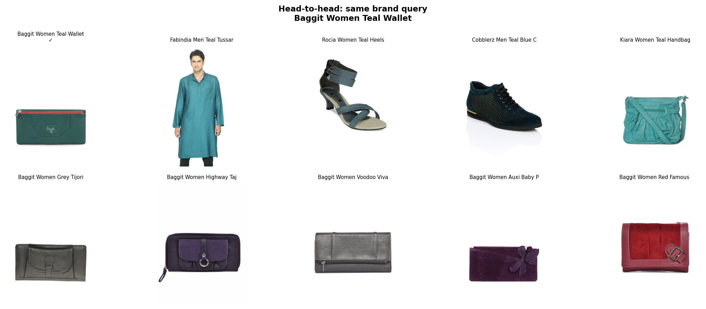

**Figure 12 - Shopper-query failure case:**

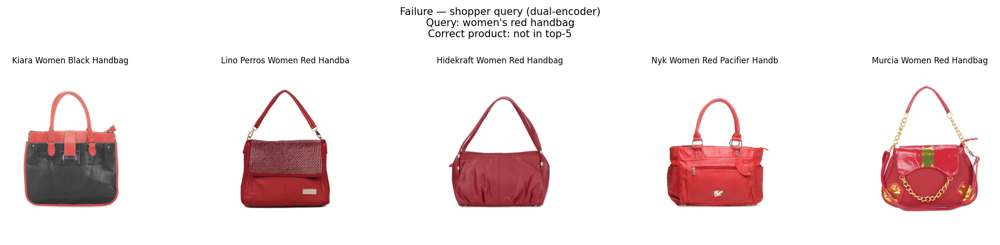

These examples show the pattern behind the metrics. The model can align broad visual categories, colors, and product types, but exact product identity is difficult when many items share the same visual attributes.

---

## 7. Interpretation and Critical Thinking

### 7.1 Why TF-IDF Wins

TF-IDF wins because the evaluation contains queries that are often text-identical or text-adjacent to the product metadata. Brand queries are product display names. Templated queries are generated from the same structured fields that appear in `product_text`. Because TF-IDF searches text against text, it receives direct evidence that the dual-encoder does not have at image-index time.

This does not invalidate the dual-encoder. It clarifies the deployment setting. If product text is available and high quality, a text retrieval system is extremely competitive. If the searchable index is image-only or weakly described, a dual-encoder is more appropriate.

### 7.2 Overfitting, Underfitting, or Architecture Ceiling?

The final model appears to hit a **data/evaluation ceiling more than a simple overfitting pattern**. Several observations support this:

- v4 improves substantially over v1 on validation Recall@1, so the architecture learned useful alignment.
- TF-IDF's biggest wins occur where text identity matters most: brand and templated queries.
- Shopper and short queries are ambiguous because many products share the same color and article type.
- The single-positive evaluation counts only the exact product as correct, even when visually similar products may be reasonable search results.

There may still be mild underfitting in the image-text alignment because the model was trained with limited compute, batch size 64, and a frozen text tower. However, simply training longer would not solve brand-name retrieval from images. The deeper limitation is that the image embedding cannot encode metadata that is not visually observable.

### 7.3 What the Ablations Teach

The v1-to-v5 experiments show that text representation quality mattered more than caption rotation. MiniLM improved semantic structure in the text space; random query-style rotation did not reliably improve retrieval because the generated queries remained synthetic and sometimes underspecified. This suggests that future gains should come from better supervision, hard negatives, real user queries, and domain-tuned multimodal pretraining rather than only more epochs.

### 7.4 When Deep Learning Still Helps

The dual-encoder remains useful for:

- Image-only galleries where TF-IDF cannot be applied
- Visual similarity search and cross-modal matching
- Shortlist retrieval where Top-5 matters more than exact rank 1
- Hybrid search systems where TF-IDF retrieves candidates and a visual model reranks them

---

## 8. Limitations

1. **Synthetic queries:** Queries are generated from catalog fields, not real user logs.
2. **Single positive per query:** The evaluation only counts the exact product as correct, even though visually similar products may be relevant.
3. **Ambiguous fashion attributes:** Queries like "black shoes" can match many products.
4. **Frozen text encoder:** MiniLM was not fine-tuned on fashion-specific search behavior.
5. **Limited compute:** Training uses a practical CPU-friendly setup rather than large-batch contrastive learning.
6. **Metadata invisibility:** Brand names, titles, and descriptions are often not visible in pixels.
7. **Reproducibility burden:** Full dual-encoder reproduction requires Kaggle data, TensorFlow, sentence-transformers, and generated model weights.

---

## 9. Conclusion and Future Work

We implemented a complete multimodal fashion retrieval project: data preparation, exploratory analysis, caption generation, EfficientNet/MiniLM dual-encoder training, TF-IDF baseline retrieval, ablation tracking, and final evaluation on a held-out test set.

The final conclusion is nuanced. TF-IDF is the stronger rank-1 search system when rich product text is available. The dual-encoder is still a valid cross-modal retrieval model and performs competitively on shopper-query Top-5 and MRR. The project therefore answers the research question while also explaining the conditions under which each search method is appropriate.

Future work:

- Fine-tune the text encoder on fashion captions and queries
- Add hard negative mining for visually similar products
- Increase effective contrastive batch size
- Use CLIP-style fashion-domain pretraining
- Evaluate with real user search logs and click-through data
- Build a hybrid system: TF-IDF shortlist followed by visual reranking

---

## References

- Aggarwal, Param. *Fashion Product Images Dataset.* Kaggle, 2019.  
  https://www.kaggle.com/datasets/paramaggarwal/fashion-product-images-dataset
- Radford, A., et al. (2021). *Learning Transferable Visual Models From Natural Language Supervision.* ICML.
- Reimers, N., & Gurevych, I. (2019). *Sentence-BERT: Sentence Embeddings using Siamese BERT-Networks.* EMNLP.
- Tan, M., & Le, Q. (2019). *EfficientNet: Rethinking Model Scaling for Convolutional Neural Networks.* ICML.

---

## Appendix A - Reproducibility

```powershell
python -m venv venv
venv\Scripts\activate
pip install -r requirements.txt
python src/download_kaggle_data.py
python src/prepare_data.py
python src/prepare_data.py --check
python src/train.py
python src/evaluate.py
```

Important artifact notes:

- `docs/reports/evaluation_results.csv` contains the committed final metrics.
- `docs/reports/ablations/*.csv` contains the validation ablation tables.
- `models/v4_image_encoder.weights.h5` is generated locally and may need to be submitted separately if graders should run dual-encoder inference without retraining.
- The first dual-encoder run downloads `sentence-transformers/all-MiniLM-L6-v2` from Hugging Face unless it is already cached.

Useful files:

- Grading guide: `docs/GRADING.md`
- Artifact guide: `docs/ARTIFACTS.md`
- Final report PDF: `docs/reports/final_report.pdf`
- Interactive demos: `notebooks/samii_experiment/04_final_results.ipynb`
- Presentation: `docs/presentation.pdf`

---

## Appendix B - Team Contributions

| Richardson Chhin | Samii Shabuse |
|---|---|
| v1-to-v5 experiment design and notebooks | Unified `src/` training and evaluation pipeline |
| Caption and query-style ablations | Data preprocessing and documentation |
| Final model selection experiments | Test-set evaluation and final report integration |

---

*Report generated for the DSCI471 Final Project. Result tables reflect `docs/reports/evaluation_results.csv` as of project submission.*
